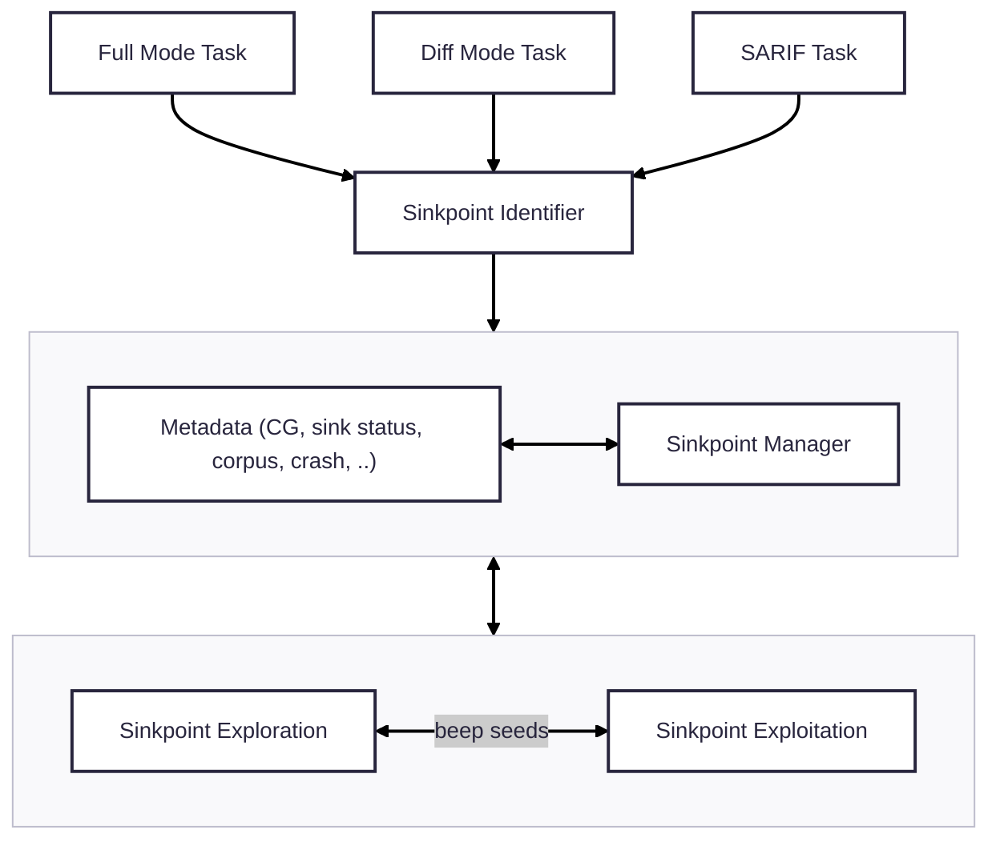

# CRS-java

CRS-java is a sinkpoint-centered Java vulnerability detection framework. It is built based on the understanding that Java CPV finding is mostly a sinkpoint exploitation task. Specifically, it can be divided into two subtasks, reaching the sinkpoint and exploiting the sinkpoint. Each subtask has its own challenges.

At the first place, it launches ensemble fuzzing with several kinds of fuzzers we built to find CPVs inside the target CP (Challenge Project), then leverages LLM, static analysis, and runtime information to conduct sinkpoint-centered analysis to boost the CPV finding by generating input blobs to fuzzers.

## Overall Architecture

In CRS-Java, we have techniques facilitating both sinkpoint exploration and exploitation. Some code locations are identified as sinkpoints and those sinkpoint reaching seeds (we call it beep seed) will be lifted to a specific exploitation phase for further PoC construction. Additionally, all components in CRS-Java are aware of the runtime status of sinkpoints, which helps them to avoid duplicate efforts on reached/exploited sinkpoints, prioritize diff-task/sarif-task related sinkpoints, etc.

Sinkpoint exploration techniques:

- directed Jazzer
- libafl-based Jazzer
- llm-poc-gen, a Joern-based, path-based, LLM-based, input generator
- concolic executor
- deepgen, initial corpus generation agent
- dictgen, dictionary generator
- fuzzing ensembler

Sinkpoint exploitation techniques:

- expkit, an LLM-based beep seed exploitation agent
- llm-poc-gen, a Joern-based, path-based, LLM-based, input generator
- concolic executor

## Source code

All implementation are at [./crs](./crs), please refer to [./crs/README.md](./crs/README.md) for more details.

## DEV

For more details of building, running, and developing CRS-java locally, see [README.dev.md](./README.dev.md).

## Integration to k8s competition env

It will be built and invoked by the entire CRS system, interfaces include:

- Docker image preparation scripts
  - `docker-build.sh`
  - `docker-img-push.sh`
- Entry script
  - `crs/run-crs-java.sh`
- Specific env var
  - `TARBALL_DIR`
  - `JAVACRS_TARBALL_DIR`
  - ..

## LICENSE

GPL V2, see [LICENSE](./LICENSE)
