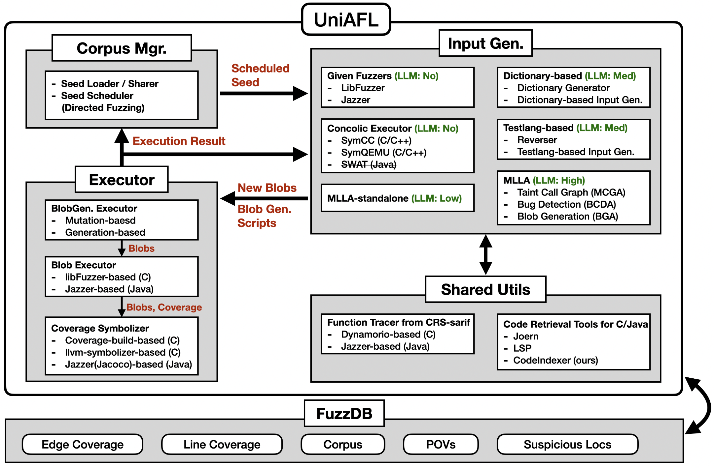

# CRS-multilang

# How to set up

0. Install Docker

1. Install Python Dependencies
```
pip install -r ./requirements.txt
```

2. Build docker images
```
./docker-build.sh
```

3. Set up [LiteLLM](https://github.com/BerriAI/litellm)
- Configure LiteLLM to support the following LLM models:
  - OpenAI Models
    - o3
    - o4-mini
    - gpt-4o
    - gpt-4o-mini
    - gpt-4.1-mini
  - Anthropic Models
    - claude-opus-4-20250514
    - claude-sonnet-4-20250514
    - claude-3-7-sonnet-20250219
    - claude-3-5-haiku-20241022
  - Google (Gemini) Models
    - gemini-2.5-pro

4. Prepare Benchmarks (Targets)
- Ensure your benchmarks follow the [OSS-Fuzz](https://github.com/google/oss-fuzz) directory structure.
- Place the OSS-Fuzz-style benchmark directories inside the `./benchmarks`.
  - Currently, we support benchmarks written in either `c` or `jvm` (`java`).
  - For example, place a benchmark named `target_repo` at `./benchmarks/projects/aixcc/{language}/target_repo`.
    - if `target_repo` is written in `c`, place it at `./benchmarks/projects/aixcc/c/target_repo`
    - if `target_repo` is written in `jvm` (`java`), place it at `./benchmarks/projects/aixcc/jvm/target_repo`.


# How to run
```
usage: run.py [-h] {show-targets,test-all,instrument-all,run,eval,build,build_crs} ...

Run CRS to find bugs in the target

options:
  -h, --help            show this help message and exit

commands:
  {show-targets,test-all,instrument-all,run,eval,build,build_crs}
    show-targets        Show all AIxCC projects
    test-all            Run test against all AIxCC projects
    instrument-all      Instrument all AIxCC projects
    run                 Run the target project
    eval                Eval the target project
    build               Build target CP
    build_crs           Build docker images

// Run CRS-multilang with all components againt the target (aixcc/c/mock-c)
LITELLM_KEY=key LITELLM_URL=url ./run.py run --target aixcc/c/mock-c --config ./crs.config --start-other-services

// Run as log mode
LITELLM_KEY=key LITELLM_URL=url ./run.py run --target aixcc/c/mock-c --config ./crs.config --start-other-services --log

// Test CRS-multilang against the target (aixcc/c/mock-c)
LITELLM_KEY=key LITELLM_URL=url ./run.py run --target aixcc/c/mock-c --test
```

You can check the results inside the CRS-multilang docker container by using this command.
```
root@3fc17dbf8f8f:/# show_result // Show found crashes and POVs
[DB] /crs-workdir/worker-0/submit/submit.db
+----------+---------------------+---------------------------+------------------------------------------------------------------------------------+--------+--------------------------------------------------------------------+------------+
| Status   | Finder              | Harness                   | PoV                                                                                | UUID   | Sanitizer Output                                                   |   Time (s) |
+==========+=====================+===========================+====================================================================================+========+====================================================================+============+
| pending  | UniAFL.given_fuzzer | fuzz_parse_buffer_section | /crs-workdir/worker-0/HarnessRunner/fuzz_parse_buffer_section/pov/acebd8064c293401 |        | __asan_memcpy--parse_buffer_section--LLVMFuzzerTestOneInput        |          4 |
|          |                     |                           |                                                                                    |        | __interceptor_malloc--parse_buffer_section--LLVMFuzzerTestOneInput |            |
+----------+---------------------+---------------------------+------------------------------------------------------------------------------------+--------+--------------------------------------------------------------------+------------+

root@3fc17dbf8f8f:/crs-workdir/worker-0/HarnessRunner/{HARNESS_NAME}# ls -als
root@3fc17dbf8f8f:/crs-workdir/worker-0/HarnessRunner/fuzz_parse_buffer_section# ls -als
total 32
4 drwxr-xr-x 7 root root 4096 Jul 22 18:09 .
4 drwxr-xr-x 4 root root 4096 Jul 22 18:09 ..
4 drwxr-xr-x 2 root root 4096 Jul 22 18:09 others_corpus
4 drwxr-xr-x 2 root root 4096 Jul 22 18:09 pov              // Has POV blobs            
4 -rw-r--r-- 1 root root    1 Jul 22 18:09 tmp
4 drwxr-xr-x 5 root root 4096 Jul 22 18:09 uniafl           // Has working directories for each module
4 drwxr-xr-x 2 root root 4096 Jul 22 18:09 uniafl_corpus    // Has blobs in corpus
4 drwxr-xr-x 2 root root 4096 Jul 22 18:09 uniafl_cov       // Has coverage data for each seed
```

If you want to run CRS-multilang and check the results with fancy web ui, please check [`./e2e-eval`](./e2e-eval/).

# CRS Config
```
{
  "target_harnesses": ["ossfuzz-1"],
}
```
The above configuration runs CRS-multilang against `ossfuzz-1` harness in the given CP.

We can add more options to the configuration like this:
```
{
  "target_harnesses": ["ossfuzz-1"],
  "ncpu": 16,                        # The number of CPU to use
                                     # default is the number of CPUs in the machine
  "others": {
    "input_gens":["given_fuzzer"]    # Options for which input generators to employ.
                                     # default is employing all input generators
  }
}
```
where a list of our input generators
```
{
  "given_fuzzer": "Run the given harness based on libFuzzer or Jazzer",
  "concolic_input_gen": "Perform concolic execution to generate new inputs",
  "testlang_input_gen": "By using LLM, infer the input grammar (testlang) of the given harness and perform grammar-based fuzzing",
  "dict_input_gen": "By using LLM, generate function-level dictionary and mutate inputs based on it",
  "mlla": "By using LLM, figure out bug candidates and create python scripts for generating new inputs and mutating the given inputs",
  "share": "Load seeds shared by other bug finding CRSs",
  "mock_input_gen": "input gen for testing our infra"
}
```

# How to deploy
Here is how to build and push all docker images for running the integrated CRS in Terraform.
```
./docker-build.sh 
./docker-img-push.sh <REGISTRY URL> <TAG>
```

# Overview

- [UniAFL](./uniafl/): Fuzzing Infrastructure
  - [Basic Infrastructure](./uniafl/src/msa/)
  - [Corpus Manager](./uniafl/src/msa/scheduler.rs)
  - [Executor](./uniafl/src/executor/)
  - [Extensible Input Generator Modules](./uniafl/src/input_gen/)
- [FuzzDB](./fuzzdb/): Database of Fuzzing Results.
- [Concolic Executor](./uniafl/src/concolic/): SymCC/SymQEMU-based Concolic Executor
- Dictionary-based Input Generator:
  - [Dictionary-Generator](./dictgen/): Ask LLM to infer dictionaries for the given function
  - [Dictionary-based Mutator](./uniafl/src/input_gen/dict/): `Function-level` dictionary-based Mutator
- Testlang-based Input Generator:
  - [Reverser](./reverser/): Figure out an input format (testlang) of the given harness
  - [Testlang-based Generator/Mutator](./uniafl/src/input_gen/testlang/)
- `M`ulti`L`ang-`L`lm-`A`gent ([MLLA](./blob-gen/multilang-llm-agent/)): LLM-based Input Generator
  - MLLA Standalone:
    - Based on the given harness and the given target, Ask LLM to
      1. Create python scripts that `generate a new input (blob)`.
      2. Create python scripts that `randomly generates inputs`.
  - MLLA:
    - Based on the given harness and the given target, Ask LLM to
      1. Analyze target and draw tainted call graphs.
      2. Based on the tainted call graphs, Find bug candidates.
      3. Based on the bug candidates and the tainted call graphs, write `python scripts` that
        - `Generate a blob` that triggers the bug candidates
        - `Randomly generate blobs` that trigger the bug candidates
        - `Randomly mutate blobs` to trigger the bug candidates


# Authors (CRS-multilang Team @Team Atlanta)
- HyungSeok Han (Lead, Integration, UniAFL)
- Jiho Kim (UniAFL, Benchmarks)
- Woosun Song (Concolic Executor)
- Dae R. Jung (Dictionary-based)
- Kangsu Kim (Testlang-based)
- Dohyeok Kim (Testlang-based)
- Eunsoo Kim (Testlang-based)
- Soyeon Park  (MLLA)
- Dongkwan Kim (MLLA)
- Sangwoo Ji (MLLA)
- Joshua Wang (MLLA)