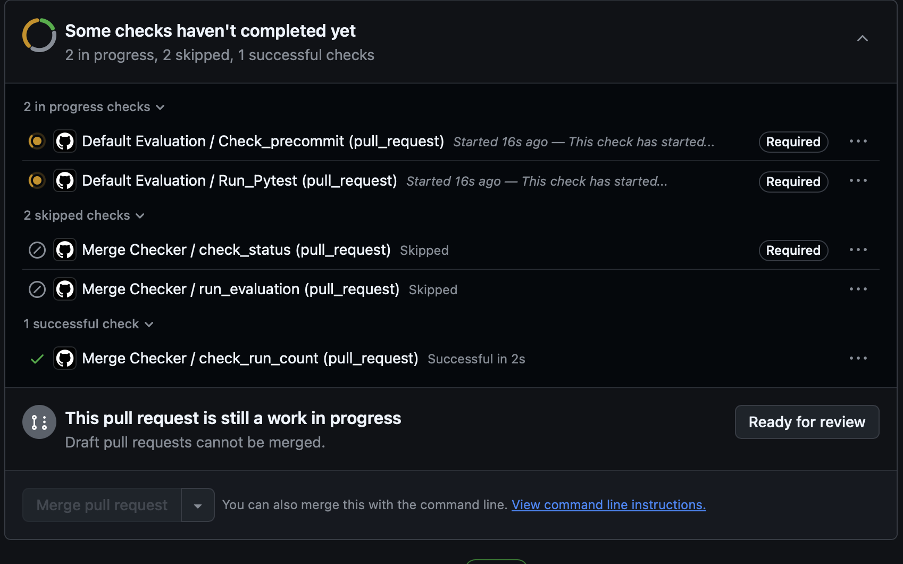
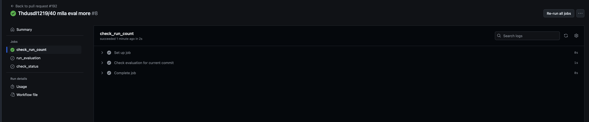
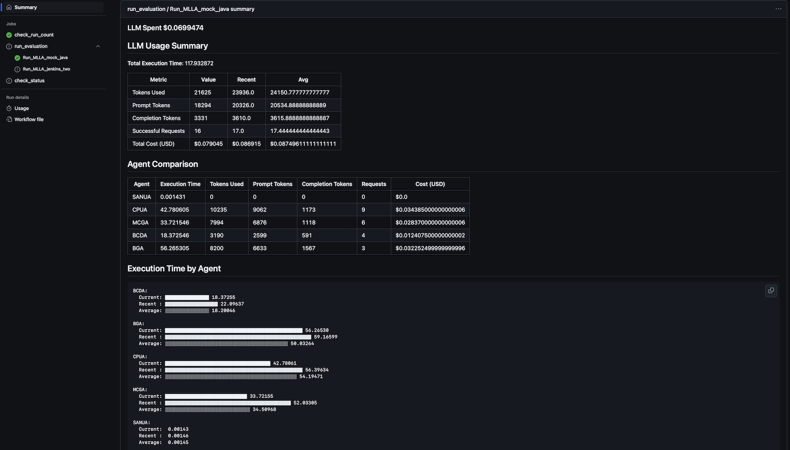

# How to merge PR under new CI?

You cannot merge your PR until the `Merge Checker/check_status (pull_request)` is passed. However, it is only triggered by manual re-running to provide a flexible option to trigger CI only when the PR is ready.

## When your PR is ready to be merged...

Click `Merge Checker/check_run_count (pull_request)`

Click `Re-run all jobs` on the right upper corner.

`Check_status` will be marked as succeed after passing all CI, and CI report is generated.
