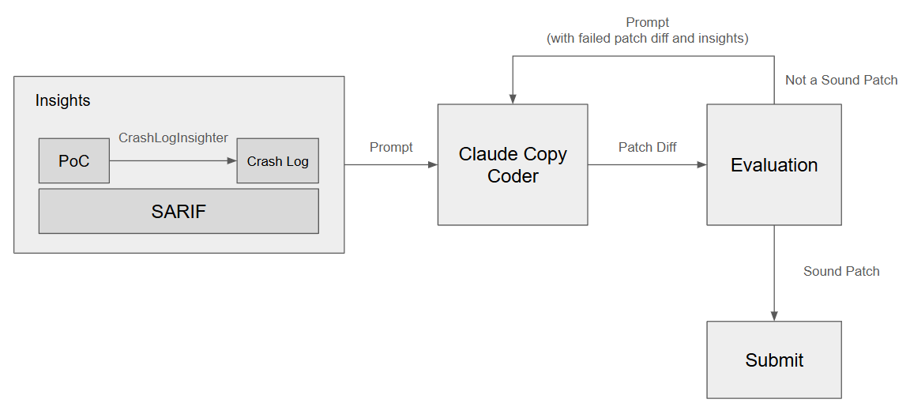

# Claude Like agent

ClaudeLike is an agent that leverages a ReAct agent called the ClaudeLike coder, which is inspired by Claude Code.
The ClaudeLike coder analyzes and modifies file structures using various File Editor Tools.
In particular, it improves efficiency by using an AgentTool that can dispatch new agents to perform complex tasks step by step, thereby reducing the context size of the main agent.



## QuickStart

```sh
$ uv sync
$ uv run scripts/setup.py
$ uv run benchmark -m apps.claude_like.claude_like scripts/benchmark/full/custom-c-mock-c-cpv-0-full.toml
```

## Core components

1. Prompt Generator
(`packages/crete/framework/agent/services/claude_like/__init__.py`)
    - Purpose: Generate a prompt for the coder from the crash log or SARIF report.
    - Implementation: Use prompt template

2. ClaudeLike Coder (`packages/crete/framework/coder/services/claude_like/__init__.py`)
    - Purpose: Generate a patch diff from a prompt.
    - Implementation:
        - Implemented the ReAct model from scratch using LangChain
            - packages/crete/framework/coder/services/claude_like/graph.py
            - packages/crete/framework/coder/services/claude_like/states.py
        - 6 file editor tools and 1 AgentTool
    - LLM model: Claude 3.7 Sonnet
    - Output: Patch diff

3. Feedback (`packages/crete/framework/agent/services/claude_like/__init__.py`)
    - Purpose: Guide the coder to generate another proper patch when the generated patch was not sound.
    - Implementation: Use feedback template

## Tools

### AgentTool

#### 1. **dispatch_agent** (`packages/crete/framework/coder/services/claude_like/tools/agent_tool.py`)

- Tool name: `dispatch_agent`
- Parameters:
    - `prompt` (str, required): The task to be performed by the agent
- Behavior:
    - Run a new agent to perform a specific task.
    - The new agent can use View, GlobTool, GrepTool, and LS tools to perform the given task.

### File Editor Tools

#### 1. **Edit** (`packages/crete/framework/coder/services/claude_like/tools/edit_tool.py`)

- Tool name: `Edit`
- Parameters:
    - `file_path` (str, required): The file path to modify (absolute path)
    - `old_string` (str, required): The string to replace
    - `new_string` (str, required): The new string to replace the old_string
- Behavior:
    - Replaces the `old_string` with `new_string` in the contents of the file at the given path.
    - `old_string` must exist and be unique in the file

#### 2. **GlobTool** (`packages/crete/framework/coder/services/claude_like/tools/glob_tool.py`)

- Tool name : `GlobTool`
- Parameters:
    - `pattern` (str, required): The glob pattern to search
    - `path` (str, optional): The directory to search in (absolute path, `path` would be working directory if not given)
- Behavior:
    - Returns the list of paths that match the given glob pattern `pattern`. Used to search for the name of a file.

#### 3. **GrepTool** (`packages/crete/framework/coder/services/claude_like/tools/grep_tool.py`)

- Tool name: `GrepTool`
- Parameters:
    - `pattern` (str, required): The regular expression pattern to search
    - `path` (str, optional): The directory to search in (absolute path, `path` would be working directory if not given)
    - `include` (str, optional): The pattern to include (glob pattern)
- Behavior:
    - Searches file contents using the given regular expression `pattern` and returns the paths of files that match the pattern.
    - The include parameter can be used to filter specific files. This tool only returns the list of paths that match the glob pattern `include`

#### 4. **LS** (`packages/crete/framework/coder/services/claude_like/tools/ls_tool.py`)

- Tool name : `LS`
- Parameters:
    - `path` (str, required): The directory path to list (absolute path)
- Behavior:
    - Lists the files in the given directory path `path`.

#### 5. **Replace** (`packages/crete/framework/coder/services/claude_like/tools/replace_tool.py`)

- Tool name: `Replace`
- Parameters:
    - `file_path` (str, required): The file path to write (absolute path)
    - `content` (str, required): The content to write
- Behavior:
    - Writes a file at the given file path `file_path`.
    - If the file exists, it overwrites the existing file.

#### 6. **View** (`packages/crete/framework/coder/services/claude_like/tools/view_tool.py`)

- Tool name: `View`
- Parameters:
    - `file_path` (str, required): The file path to read (absolute path)
    - `offset` (int, optional): The start line number to read from. It's a 1-based index
    - `limit` (int, optional): The number of lines to read
- Behavior:
    - Reads a file from the given file path `file_path`.
    - `offset` and `limit` are used when the content of the file is too long.

## Design Principles

- Extensibility: New tools can be easily added by modifying the coder’s `get_tools` method.
- Observability: All LLM requests and responses are stored in the `.claude_like_llm_history_log` file, and additional artifacts are saved in the agent_output_directory to facilitate tracking and analysis of the agent’s behavior and results.
- Fault Tolerance: The agent should continue to operate reliably even when the LLM server is experiencing high load or temporary failures. Additionally, tools should be robust against invalid or inappropriate inputs and handle them properly.

## Reference

- https://www.anthropic.com/claude-code
- https://langchain-ai.github.io/langgraph/how-tos/react-agent-from-scratch/
