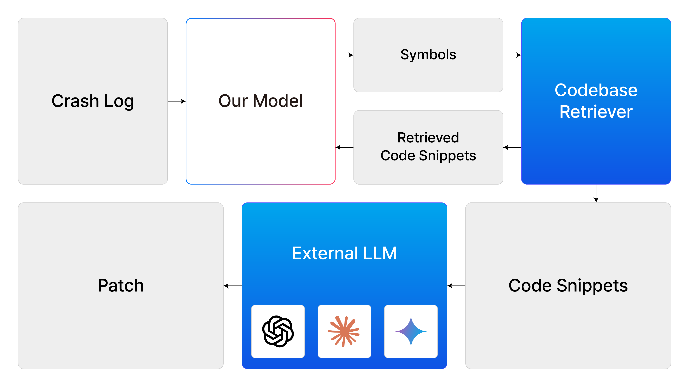
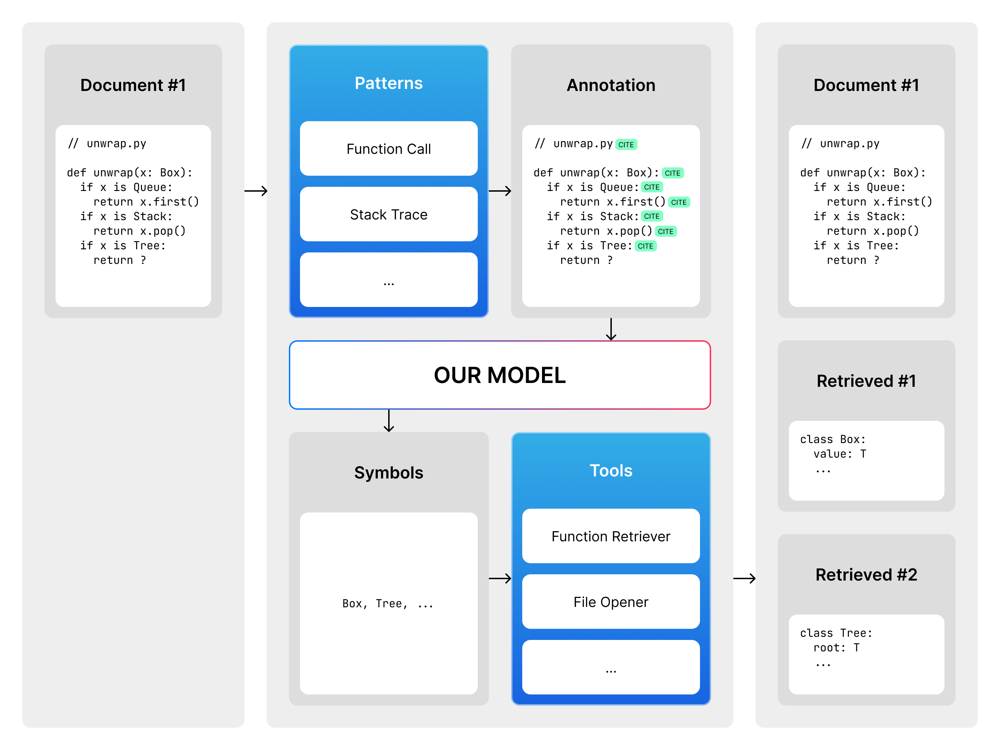

# Eraser Agent

## Overview



Eraser agent redefines code retrieval as an **iterative and trainable process**, moving beyond traditional static heuristics.

## Retrieval Pipeline



The process consists of the following stages:

1. **Symbol Extraction**: Identify code symbols using rule-based pattern matching.
2. **Symbol Ranking**: Use a trained model to prioritize symbols based on relevance.
3. **Snippet Retrieval**: Fetch code snippets associated with prioritized symbols from repositories and tools.
4. **Iterative Refinement**: Repeat the retrieval loop to improve context accuracy.

This approach allows the model to **build contextual understanding incrementally**, yielding better downstream performance in automated patch generation.

## Quick Start

> [!TIP]
> Serve the pre-tuned custom model `betarixm/eraser` from the Hugging Face Hub using an OpenAI-compatible API (e.g., vllm).

```sh
uv sync
uv run scripts/setup.py
uv run benchmark -m apps.eraser._eraser scripts/benchmark/full/custom-c-mock-c-cpv-0-full.toml
```

## Core components

1. Policy (`packages/crete/framework/eraser/services/eraser/__init__.py`)
    - Purpose: Defines the retrieval policy, including symbol retrieval logics.
    - Implementation: Uses a trained model to select symbols based on relevance.
    - LLM model: `betarixm/eraser`
    - Output: Selected list of symbols.
2. Patch Generator (`third_party/p4/p4/__init__.py`)
    - Purpose: Generates a patch in unified diff (udiff) format using the output from the policy, including the identified symbols and their context.
    - Implementation: Uses a langchain agent with file editing tools.
    - LLM model: `gpt-4.1`

## Tools

### Policy Tools

1. C++ Type Definition Tool (`third_party/p4/p4/__init__.py`)
    - Tool name: `CppTypeDefinitionTool`
    - Parameters:
        - `x` (`Symbol`, required): The symbol to retrieve type definition for.
    - Behavior: Uses `ctag` and `tree-sitter` to find the type definition of the given symbol.
2. C++ Function Definition Tool (`third_party/p4/p4/__init__.py`)
    - Tool name: `CppFunctionDefinitionTool`
    - Parameters:
        - `x` (`Symbol`, required): The symbol to retrieve function definition for.
    - Behavior: Uses `ctag` and `tree-sitter` to find the function definition of the given symbol.
3. Java Method Declaration Tool (`third_party/p4/p4/__init__.py`)
    - Tool name: `JavaMethodDeclarationTool`
    - Parameters:
        - `x` (`Symbol`, required): The symbol to retrieve method declaration for.
    - Behavior: Uses `ctag` and `tree-sitter` to find the method declaration of the given symbol.

### Patch Generation Tools

1. edit (`third_party/p4/p4/__init__.py`)
    - Tool name: `edit`
    - Parameters:
        - `file_path` (string, required): The path to the file to edit.
        - `search` (string, required): The search string to find the location to edit.
        - `replacement` (string, required): The replacement string to edit.
    - Behavior: Searches for the given string in the specified file and replaces it with the replacement string.
