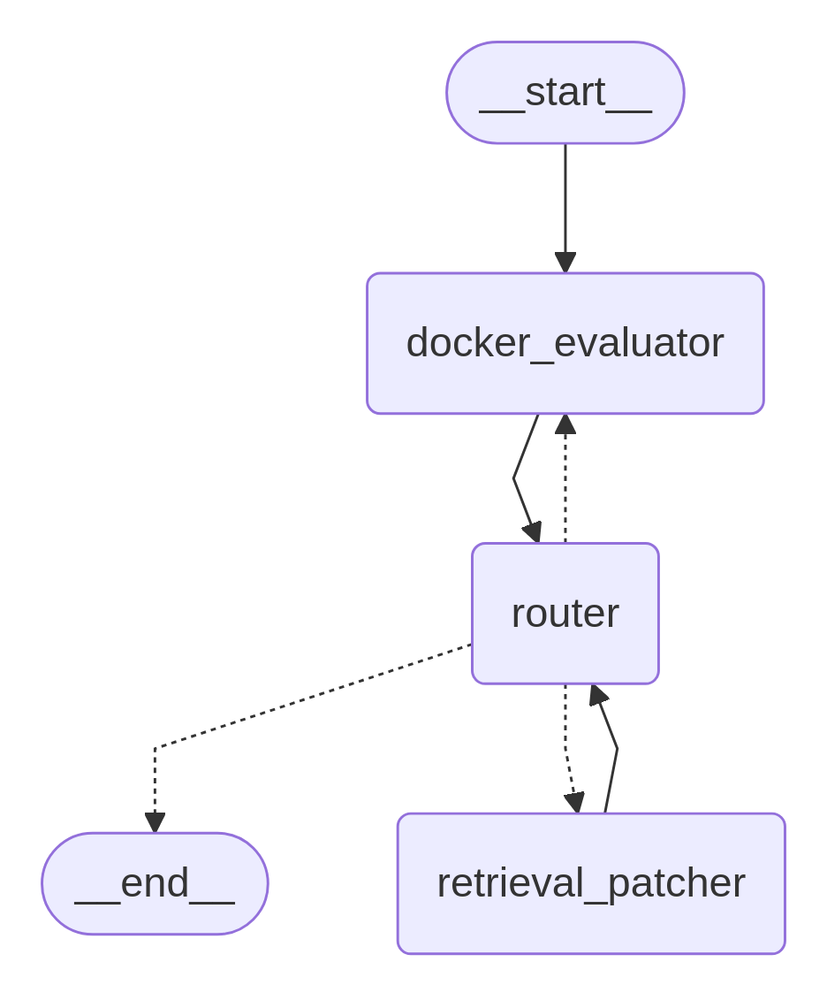

# Multi-Retrieval Agent

The Multi-Retrieval Agent is a software patching agent designed to automatically fix vulnerabilities in source code. The system leverages large language models (LLMs) alongside augmented code retrieval mechanisms and containerized evaluation environments to generate patches.

The agent uses a state-based architecture using LangGraph to coordinate between analysis, retrieval, and evaluation phases. Through Docker-based evaluation and iterative refinement, it generates patches that not only address vulnerabilities but also maintain compatibility with the existing codebase and tests.



## QuickStart

```sh
$ uv sync
$ uv run scripts/setup.py
$ uv run benchmark apps.multi_retrieval.multi_retrieval_claude_3_7 scripts/benchmark/full/custom-c-mock-c-cpv-0-full.toml
```

## System Architecture

The Multi-Retrieval Agent follows a modular architecture with four main layers:

1. **Agent Layer**: Top-level orchestrator managing the overall patching process
2. **Workflow Layer**: State-based graph workflows coordinating between components
3. **Node Layer**: Specialized components for retrieval, patching, and evaluation
4. **State Management Layer**: Maintains current state of the patching process

## Core Components

### 1. MultiRetrievalPatchAgent (`packages/crete/framework/agent/services/multi_retrieval/__init__.py`)

**Purpose**: Main entry point orchestrating the entire patching lifecycle

**Key Features**:
- Initializes `SystemGuidedPatchWorkflow` with appropriate LLM configurations
- Implements fallback mechanisms for switching to backup LLMs on error
- Maintains comprehensive logs throughout the remediation process
- Generates structured output for downstream consumption

**Configuration**: Primary and backup LLMs configured per deployment
**Output**: Final patch in unified diff format or NoPatchAction

### 2. SystemGuidedPatchWorkflow (`packages/crete/framework/agent/services/multi_retrieval/workflows/system_guided_patch_workflow.py`)

**Purpose**: Central orchestrator with the state graph and routing execution

**Architecture**:
- LangGraph StateGraph with three nodes: `docker_evaluator`, `retrieval_patcher`, `router`
- Manages transitions based on PatchAction states
- Enforces evaluation limits to prevent infinite loops
- Maintains state consistency across all nodes

**Workflow Flow**: 

`START` → `docker_evaluator` → `router` → `retrieval_patcher` → `router` → ... → `docker_evaluator` → `END`


**Output**: Final diff

### 3. SystemGuidedPatcher (`packages/crete/framework/agent/services/multi_retrieval/nodes/patchers/system_guided_patcher.py`)

**Purpose**: Core intelligence analyzing issues and generating patches

**Workflow**:
1. **Issue Analysis**: Examines error logs and previous attempts
2. **Exploration Planning**: Generates plans to guide retrieval toward relevant code
3. **Strategic Decision**: Determines whether to gather more context or generate patches

**Key Capabilities**:
- Understands root causes through iterative analysis
- Maintains code consistency and follows established patterns
- Makes decisions about context sufficiency
- Generates patches addressing issues without introducing new problems

**Output**: Exploration plans, retrieval queries (`<grep>`/`<file>` tags), or patches (`<patches>` tags)

### 4. CodeRetrieverSubgraph (`packages/crete/framework/agent/services/multi_retrieval/nodes/retrievers/code_retriever_subgraph.py`)

**Purpose**: Multi-strategy retrieval system for gathering code context

**Retrieval Strategies**:
1. **Ripgrep Search**: Fast text searches for usage patterns and implementations
2. **AST-based Retrieval**: Augmented ripgrep search using abstract syntax tree analysis
3. **File Retrieval**: Complete file or line range access for broader context

**Implementation**:
- Parallel execution of retrieval strategies for efficiency
- Priority-based aggregation (HIGH for exact matches, MEDIUM for partial)
- Graceful handling of query failures with informative feedback
- Deduplication to avoid redundant results

**Output**: Priority-sorted, deduplicated code snippets with metadata

### 5. DockerEvaluator (`packages/crete/framework/agent/services/multi_retrieval/nodes/evaluators/docker_evaluator.py`)

**Purpose**: Patch validation in isolated Docker environments

**Evaluation Process**:
1. **Compilation Validation**
   - Verifies patches apply cleanly without conflicts
   - Checks syntactic correctness and compilation success
   - Catches syntax errors, type mismatches, missing imports

2. **Vulnerability Testing**
   - Executes proof-of-vulnerability tests
   - Confirms original issue is resolved
   - Reports if new issue arises

3. **Regression Testing**
   - Runs existing test suites
   - Verifies functional correctness
   - Reports if tests failed

**Output**: Updated patch status, filtered error logs, failure feedback

## Tools

### Retrieval Query Types

#### 1. **Grep queries** (`<grep>` tags)

- Query format: `<grep>query_string</grep>`
- Accepted queries:
    - Fully qualified class names (e.g., `example.using.fully.qualified.ClassName`)
    - Function names (e.g., `function_name`)
    - Method names (e.g., `ClassName.methodName`)
    - Variable type names
    - One-line code snippets
- Behavior:
    1. Performs grep search using ripgrep
    2. Augment the grep search through analyzing the AST of the searched file
    3. Results prioritized code snippets with line numbers
- Output: Code blocks with file path and line ranges

#### 2. **File queries** (`<file>` tags)

- Query format: `<file>path/to/file.py</file>` or `<file>path/to/file.py:20-30</file>`
- Parameters:
    - File path (relative to repository root)
    - Optional line range (start-end)
- Behavior:
    1. FileRetriever fetches complete file or specified lines
    2. Lower priority (LOW) compared to grep queries
    3. Limited to 1 file query per retrieval request
- Output: File contents with line numbers

### State Management

#### PatchState

Central repository maintaining all patching process information:
- **Current Action**: Tracks workflow phase (analyzing, retrieving, evaluating)
- **Patch Status**: Indicates patch quality and evaluation results
- **Conversation History**: Complete LLM interactions for context
- **Generated Patch**: Unified diff format modifications
- **Applied Modifications**: List of successful code changes
- **Evaluation Count**: Tracks attempts to enforce limits

#### PatchAction States

- `ANALYZE_ISSUE`: Analyze the problem and generate exploration plan
- `RETRIEVE`: Execute retrieval queries or generate patches
- `EVALUATE`: Run Docker evaluation on generated patches
- `DONE`: Terminal state when patching is complete

#### PatchStatus States

- `INITIALIZED`: Initial state before evaluation
- `UNCOMPILABLE`: Patch failed to compile or apply
- `COMPILABLE`: Patch compiles but still vulnerable
- `VULNERABLE`: Original vulnerability still present
- `SOUND`: Vulnerability fixed, ready for test validation
- `TESTS_FAILED`: Internal tests failed
- `UNKNOWN`: Unexpected error occurred

#### RetrievalState

Manages the code retrieval process:
- Query lists and execution status
- Raw retrieval results from different sources
- Priority-sorted and deduplicated collections
- Failed queries for understanding unavailable code

## Workflow Process

### Main Execution Algorithm

```
1. Initialize PatchState with repository path
2. Set initial action to EVALUATE
3. While action ≠ DONE and n_evals < max_n_evals:
   
   If action = EVALUATE:
      - Run proof-of-vulnerability test (if first time)
      - Evaluate current patch (if patch exists)
      - Update status based on results
      - If SOUND: run tests → DONE or ANALYZE_ISSUE
      - Else: → ANALYZE_ISSUE
   
   If action = ANALYZE_ISSUE:
      - Analyze error logs and vulnerability reports
      - Generate exploration plan
      - → RETRIEVE
   
   If action = RETRIEVE:
      - Assess current context sufficiency
      - If needs more context:
        - Execute retrieval queries
        - Aggregate and format results
      - Else:
        - Generate patches
        - → EVALUATE

4. Return final diff
```

### Detailed Phase Descriptions

#### 1. Initial Evaluation (PatchAction.EVALUATE)
DockerEvaluator confirms vulnerability existence through proof-of-vulnerability tests. This establishes baseline behavior and provides initial crash logs for analysis.

#### 2. Issue Analysis (PatchAction.ANALYZE_ISSUE)
SystemGuidedPatcher performs deep analysis of error logs, stack traces, and vulnerability descriptions. Generates exploration plans guiding subsequent retrieval.

#### 3. Retrieval and Patching (PatchAction.RETRIEVE)
Iterative phase where the system gathers context or generates patches based on available information. Uses parallel retrieval strategies for efficiency.

#### 4. Patch Evaluation (PatchAction.EVALUATE)
Comprehensive validation ensuring patches resolve issues without regressions. Continues iterating until success or limit reached.

### Patch Generation Format

The SystemGuidedPatcher generates patches in a specific XML format(Markdown code backticks are omitted):
```xml
<patches>
<patch>
<original_code>
11:int add(int a, int b) {
12:    return a - b;
13:}
</original_code>
<code_lines_to_replace>
path/to/file.c:11-13
</code_lines_to_replace>
<patched_code>
int add(int a, int b) {
    return a + b;
}
</patched_code>
</patch>
</patches>
```

## Design Principles

- **Iterative Refinement**: Multiple rounds of analysis, retrieval, and evaluation ensure high-quality patches
- **State-based Architecture**: LangGraph provides robust state management and workflow orchestration
- **Predefined Routing**: Dynamic adaptation to predefined routes based on current state and results
- **Comprehensive Context**: Detailed prompts and conversation history guide LLM decisions
- **Robust Error Handling**: Fallback mechanisms and graceful degradation ensure reliability
- **Modular Design**: Components can be replaced or upgraded independently

### Output Formats
- **Unified Diff Patches**: Compatible with git and patch utilities
- **Detailed Logs**: Complete process chronicle for debugging
- **JSON Histories**: Structured conversation data for analysis
- **Action Objects**: Success/failure indicators with metadata

## Future Directions

- Expanded language support beyond C/Java
- Enhanced static analysis integration
- ML-based retrieval ranking improvements
- Automated test generation for validation

## References

- LangGraph documentation: https://langchain-ai.github.io/langgraph/