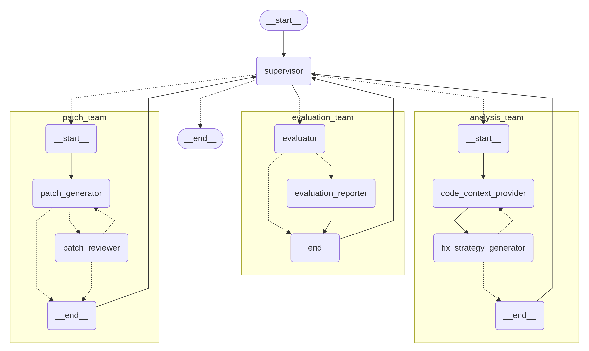

# Prism Agent

Prism is an advanced multi-agent system designed to automatically fix vulnerabilities in source code. The system employs a hierarchical team-based architecture where specialized agents collaborate through a state-managed workflow to analyze vulnerabilities, generate patches, and validate their effectiveness. Built on LangGraph's state machine framework and powered by large language models, Prism demonstrates how complex software engineering tasks can be decomposed into manageable subtasks handled by domain-specific agents.

The system uses three specialized teams (Analysis, Evaluation, Patch) coordinated by a Supervisor through a centralized finite state machine. This division enables focused expertise while maintaining system-wide coordination. By leveraging large language models with LangGraph, Prism achieves both the flexibility needed to handle diverse vulnerabilities and the reliability required for production environments.



## QuickStart

```sh
$ uv sync
$ uv run scripts/setup.py
$ uv run benchmark apps.prism.prism_o4_mini scripts/benchmark/full/custom-c-mock-c-cpv-0-full.toml
```

## System Architecture

Prism employs a hierarchical multi-agent architecture consisting of three specialized teams coordinated by a supervisor agent.

The architecture follows a clear separation of concerns principle:

1. **Orchestration Layer**: PrismAgent entry point and Supervisor coordination
2. **Team Layer**: Three specialized teams (Analysis, Evaluation, Patch) with focused expertise
3. **Agent Layer**: Individual agents within teams handling specific subtasks

## Core Components

### 1. PrismAgent (`packages/crete/framework/agent/services/prism/__init__.py`)

**Purpose**: Main entry point and orchestrator that initializes the team structure, manages computational graph compilation, and handles overall execution flow

**Key Features**:
- Initializes LangGraph StateGraph with four nodes: `supervisor`, `analysis_team`, `evaluation_team`, `patch_team`
- Maintains both primary and backup LLM configurations to ensure robustness against service failures
- Receives objects containing vulnerability and codebase information
- Manages team initialization and state graph compilation

**Workflow Flow**: 
`START` → `supervisor` → `evaluation_team`→ `supervisor`→ `analysis_team` → `supervisor` → `patch_team` → `supervisor` → ... → `END`

**Output**: Final patch in unified diff format

### 2. Supervisor (`packages/crete/framework/agent/services/prism/__init__.py`)

**Purpose**: Central coordinator implementing the finite state machine that governs execution flow between teams

**Key Capabilities**:
- Maintains awareness of current system state and makes routing decisions
- Recognizes when satisfactory patches have been achieved
- Enforces maximum evaluation limits to prevent infinite loops

**Output**: Next team to execute and updated evaluation counter

### 3. Analysis Team (`packages/crete/framework/agent/services/prism/teams/analysis/`)

**Purpose**: Responsible for understanding vulnerability context and developing comprehensive fix strategies

**Team Composition**:
- **CodeContextProvider**: 
  - Explores codebase to gather relevant code snippets and build comprehensive understanding
  - Employs both top-down and bottom-up exploration strategies
  - Uses augmented grep-based searches(See Multi-Retrieval Agent for details) and file retrieval to construct analysis notebook incrementally
- **FixStrategyGenerator**: 
  - Takes collected context and develops detailed fixing strategies
  - Analyzes not just immediate symptoms but seeks to identify root causes
  - Considers broader codebase patterns and existing implementations
  - Can iterate multiple times based on vulnerability complexity

**Workflow**: 
`code_context_provider` → `fix_strategy_generator`

**Output**: Analysis notebook with fix strategies and relevant code context (analysis report)

### 4. Evaluation Team (`packages/crete/framework/agent/services/prism/teams/evaluation/`)

**Purpose**: Validates patches and provides detailed feedback for failed attempts

**Team Composition**:
- **Evaluator**: 
  - Executes patches against codebase in Docker containers
  - Runs proof-of-vulnerability tests and internal test suites
  - Handles various failure modes from compilation errors to runtime vulnerabilities
  - Processes logs from different programming languages with appropriate filtering
- **EvaluationReporter**: 
  - Generates comprehensive reports for failed patches
  - Analyzes failure patterns and provides actionable feedback
  - Guides subsequent analysis and patch generation cycles
  - Enables system to learn from unsuccessful attempts

**Workflow**: 
`evaluator` → `{evaluation_reporter | END}`

**Output**: Patch status and filtered issue logs (evaluation report)

### 6. Patch Team (`packages/crete/framework/agent/services/prism/teams/patch/`)

**Purpose**: Transforms analysis insights and evaluation feedback into concrete code modifications

**Team Composition**:
- **PatchGenerator**: 
  - Creates patches based on fix strategies and previous evaluation results
  - Maintains awareness of previously attempted patches to avoid repetition
  - Applies patches incrementally, building upon successful partial fixes
- **PatchReviewer**: 
  - Validates generated patches for correctness and adherence to coding standards
  - Helps catch potential issues before evaluation
  - Improves efficiency by reducing obviously flawed patches

**Workflow**: 
`patch_generator` → `patch_reviewer` → `{patch_generator | END}` (review loop)

**Output**: Validated patch in unified diff format

## Tools and Capabilities

### Code Exploration Tools

The system employs code exploration tools that enable agents to navigate and understand large codebases efficiently. It builds upon the tools in the Multi-Retrieval Agent:

#### 1. **Augmented Grep-based Search**

**Capabilities**:
- Grep-based exact matching for finding specific patterns
- Supports both targeted searches for known patterns and exploratory analysis
- Returns code snippets with surrounding context
- Enables incremental exploration building on previous findings

**Usage**: Function names, class names, patterns, or code snippets

#### 2. **File Retrieval**

**Capabilities**:
- File content retrieval with configurable line ranges
- Directory structure exploration for understanding code organization
- Provides broader context for understanding code relationships

**Usage**: File paths with optional line ranges (e.g., `path/to/file.c:10-50`)

### Evaluation Infrastructure

Prism's evaluation capabilities encompass testing and validation:

#### 1. **Docker-based Evaluation**

**Capabilities**:
- Compilation verification to ensure patches apply
- Vulnerability testing through proof-of-vulnerability execution
- Comprehensive test suite validation for regression detection
- Optional SARIF Integration

## State Management

### State Hierarchy

Prism employs a hierarchical state management system that maintains context across team boundaries while allowing for team-specific extensions:

#### 1. **CommonState**
Forms the foundation containing essential information shared across all teams:
- Repository path and working directory
- Current diff and patch status
- Evaluation reports and analysis findings
- Relevant code snippets collection

#### 2. **InterTeamState**
Extends CommonState with supervisor-level information:
- Current team status (START, EVALUATE, ANALYZE, PATCH, END)
- Evaluation counter for iteration tracking
- Routing decisions based on system progress

#### 3. **Team-specific States**
Each team maintains specialized state extending the common foundation:

**AnalysisTeamState**:
- Analysis notebook cells for incremental exploration
- Fix strategy attempts and refinements
- Code context accumulation from searches

**EvaluationTeamState**:
- Detailed issue logs from Docker evaluation
- Patch status with specific failure reasons
- Test results and error patterns

**PatchTeamState**:
- Review feedback and improvement suggestions
- Review iteration counter
- Patch history for avoiding repetition

### State Transitions

The system follows a directed graph of state transitions that ensure logical progression through the patching process:

`START` →
`EVALUATE` (initial vulnerability confirmation) →
`ANALYZE` (context gathering and strategy development) →
`PATCH` (patch generation and review) → 
`EVALUATE` (patch validation) → 
{`ANALYZE` if failed | `END` if successful}

The supervisor controls these transitions based on patch effectiveness and iteration limits. The compression of context is handled naturally with the state transitions.

## Future Directions

- Expanded language support beyond C/Java
- Enhanced static analysis integration
- ML-based retrieval ranking improvements
- Automated test generation for validation

## References

- LangGraph documentation: https://langchain-ai.github.io/langgraph/
