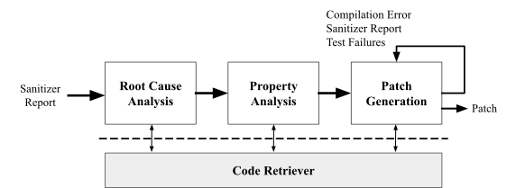

# Vincent agent
<div style="text-align: center;">

</div>

Vincent is an agent designed to fix security bugs based on a sanitizer report and PoC (Proof of Concept) information.

To generate a patch, the agent performs three analysis steps:
(i) root cause analysis,
(ii) property analysis, and
(iii) patch generation.

Vincent is primarily implemented using the Langchain library.
Note that the current prompts for Vincent are tuned for the Gemini 2.5 Pro model.

## QuickStart

```sh
$ uv sync
$ uv run scripts/setup.py
$ uv run benchmark -m apps.vincent.vincent_gemini_2_5_pro scripts/benchmark/full/custom-c-mock-c-cpv-0-full.toml
```

## Directory Structure

The main directory of the Vincent agent is `packages/crete/framework/agent/services/vincent`.

```
packages/crete/framework/agent/services/vincent/
├── code_inspector: Code search component based on the ctags utility and tree-sitter library
├── nodes: Langchain-based node implementation
│   └── analyzers
│       └── init_analyzer.py: A node that provides a system prompt, sanitizer report, and (optional) PoC byte information
│       └── root_cause_analyzer.py: A node for root cause analysis
│       └── property_analyzer.py: A node for property analysis
│   └── patchers: A node for patch generation
│   └── requests: Handlers that resolve LLM's codebase information request
├── prompts : Main prompts used by Vincent agent
├── states : Agent state implementation for langchain
└── workflow: Langchain-based workflow for the Vincent agent
```

## Code Search of Vincent

* reference: `packages/crete/framework/agent/services/vincent/code_inspector`

During the analysis, the LLM can request code information as needed.
The main class for code search is the `VincentCodeInspector` class (`packages/crete/framework/agent/services/vincent/code_inspector/__init__.py`).
Based on the ctags utility and tree-sitter library, `VincentCodeInspector` supports the following two major interfaces:
* `get_definition(target_name)`: Finds the definition of `target_name` (e.g., function, variable, struct names, etc)
* `get_references(target_name)`: Finds code snippets that references the given `target_name` (e.g., function, variable, struct names, etc)

Due to the distinct structures between C/C++ and Java, each sub-directory (`cpp` and `java`) implements language-specific features.

## Workflow

As described before, Vincent performs three analysis steps.

### Root cause Analaysis

* reference: `nodes/analyzers/root_cause_analyzer.py`

Given the sanitizer report and (optionally) PoC byte information, Vincent first explores the root cause of the crash. As a result, Vincent stores the root cause analysis report in the LLM context.

### Property Analysis. 

* reference: `nodes/analyzers/property_analyzer.py`

To provide more context-aware patches, Vincent extracts program properties from the given codebase and sanitizer report.
A property is a concept often used in software verification engineering, typically expressed in logic.
Vincent extracts bug-related properties in natural language, which are then stored in the LLM context.
Using this information, the LLM can create more context-aware patches.

### Patch Generation

* reference: `nodes/patchers/patcher.py`

Based on the analysis results, Vincent attempts to generate a valid patch for the identified bug.
To create a patch, Vincent uses a specific format for LLM's patch generation, referred to as a "patch segment":

```
[PATCH:`filename`:line_range]
// Patched code
[/PATCH]
```

To be specific, for the patch target file `filename`, the `Patched code` will replace the lines specified in the `line_range`.

Whenever the patcher generates a patch, Vincent evaluates the quality of the patch using the default evaluator in Crete.
A patch can result in one of the following four outcomes:
1. Sound patch
2. Sanitizer report
3. Compilation errors
4. Test failure

In the case of outcome 1 (Sound patch), Vincent submits the patch to the administrator system.

In the cases of outcomes 2, 3, or 4, Vincent retries the patch generation process using the previous evaluation results (i.e., feedback-based, iterative patch generation).
